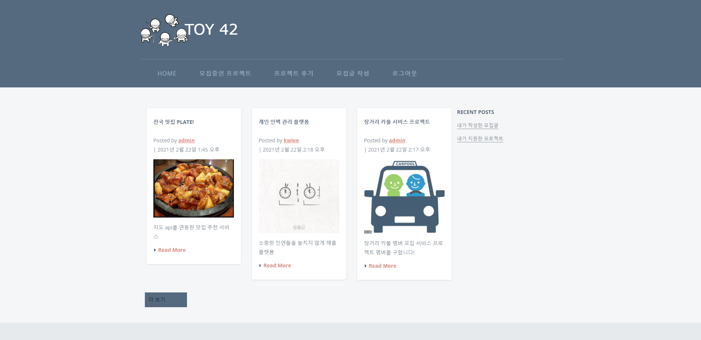

### 1.프로젝트 명 = TOY42
   - TOY42프로젝트는 토이프로젝트를 함께할 동료를 매칭해주는 웹앱프로젝트입니다.
<br/>
<br/>
     





<br/>
<br/>
<br/>
<br/>
<br/>
<br/>
<br/>


### 2. 프로젝트 정보
- 사용된 패키지 정보

``` 
    python 3.8
    asgiref==3.3.1
    Django==3.1.5
    django-bootstrap4==2.3.1
    django-environ==0.4.5
    Pillow==8.1.0
    psycopg2==2.8.6
    pytz==2020.5
    soupsieve==2.1
    sqlparse==0.4.1
   - 또한 개발환경은 os-windows10, 개발환경-pycharm 2020.3.3 사용했으며
   adobeXD를 사용하여 기획하였습니다.
```     
<br/>
<br/>
- django, bootstrap, mysql을 사용했습니다.


<br/>
<br/>
<br/>
<br/>
<br/>
<br/>
<br/>


### 3. 프로젝트 기능
1. 모집글작성


<br/>
<br/>
2. 댓글로 간단한 Q&A가 가능한 모집글
 
   
<br/>
<br/>
3. 해당 프로젝트에 팀원으로 지원하기


<br/>
<br/>
4. 게시글 작성자만 내가 작성한 모집글에서 컨텍 가능

<br/>
<br/>
5. 해당 링크로 이동하여 지원글 상세확인


<br/>
<br/>
6. 간단한 comment와 함께 매칭 or 거절


<br/>
<br/>


7. 지원자는 내가 지원한 지원글 에서 확인가능합니다.(진행 상태가 수락으로 바뀜)


<br/>
<br/>
<br/>
<br/>
<br/>
<br/>
<br/>

### 프로젝트 Flow


